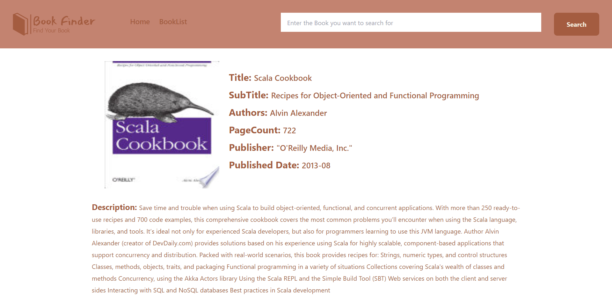

# Description
A Searching App, which searches the name of the book using Google's bookapi and return us the date. It is made in react typescript and tailwind. Initial data which is present on homepage is a result of empty search string.
- Future Updates might include filter options to give more control over the searching.

## SnapShot of Project
- Book Finder HomePage

- Single Book Page

# Deployed Version

[Live Link](https://bookfinder-akj.netlify.app/)

## Available Scripts

You will have to add your key to the .env.local file and run the project for it to work.
In the project directory, you can run:

### `npm start` 
to start the app

### `npm run-script build`

Builds the app for production to the `build` folder.\
It correctly bundles React in production mode and optimizes the build for the best performance.

